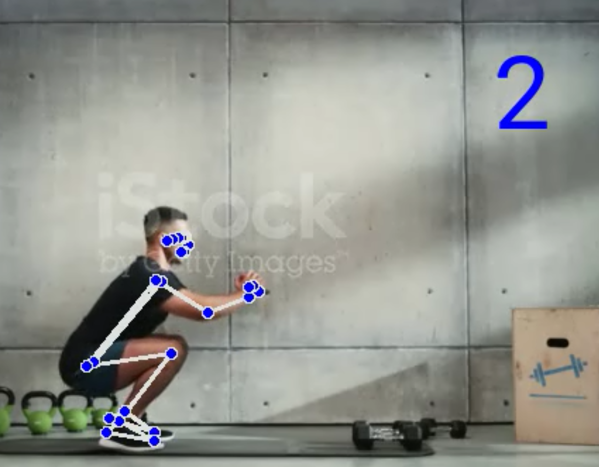
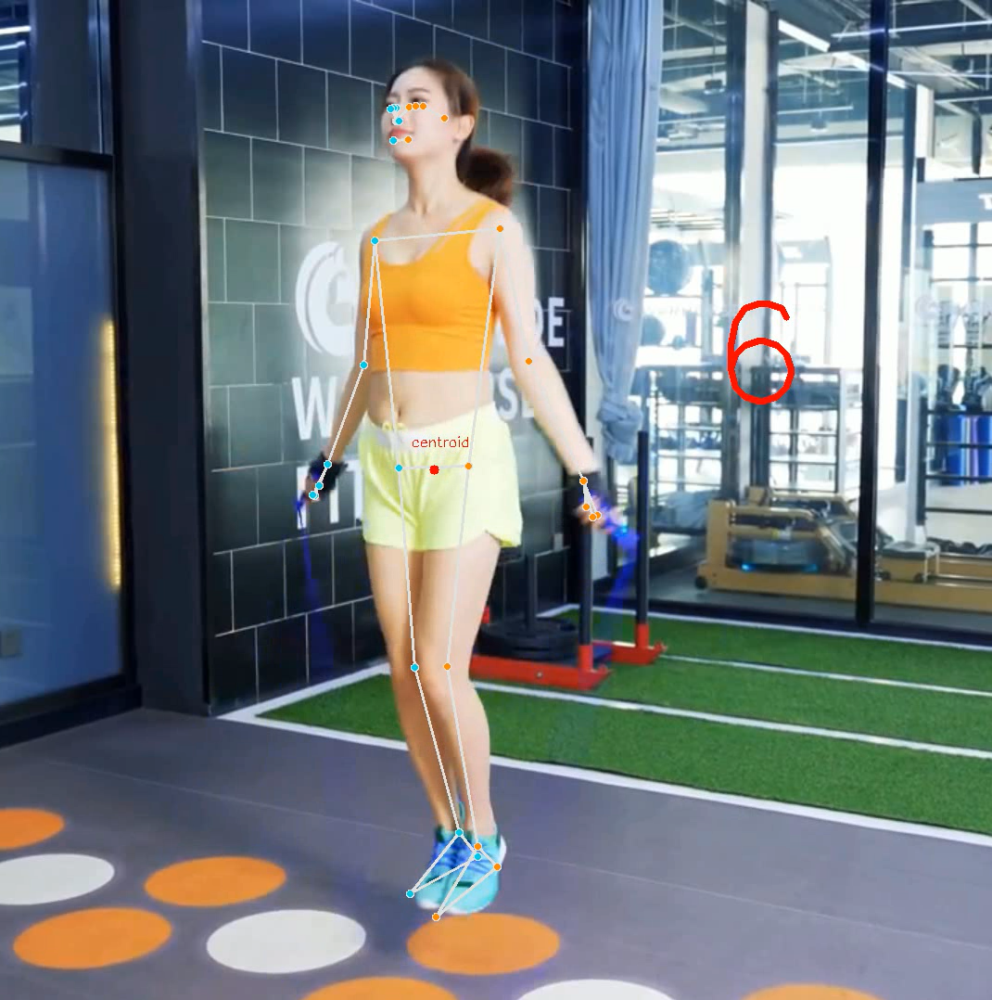

# 项目简介

基于MediaPipe+Python的健身计数小助手，可对深蹲和跳绳两种运动进行实时or视频计数

深蹲：



跳绳：




# 项目结构
## 文件夹
```
poses_images_in 用于模型训练的姿态图片

poses_images_out mediapipe识别后的姿态图片

rope_skip_csv 跳绳图片中提取的特征值

squat_csv 深蹲图片中提取的特征值

readme_img 说明文档使用的截图
```
## python文件
```
rope_video_process.py 跳绳视频检测并计数

pose_embed.py 人体关键点归一化编码

pose_classify.py 使用kNN算法的人体姿态分类

result_smooth.py 分类结果平滑，使用的是指数移动平均

rope_videocap.py 跳绳摄像头检测模块

counter.py 计数代码

visualizer.py 分类结果可视化模块

video_process.py 深蹲视频检测并计数

video_capture.py 深蹲调用摄像头实时检测并计数

main.py 主函数，项目运行入口
```
## 其他文件
```
Roboto-Regular 字体文件

requirements.txt 项目配置文档

README.md 项目说明文档

rope-skip-001.mp4、squat-001.mp4、squat-002.mp4是样本测试视频，
用户使用时可以导入视频到项目列表，在控制台输入视频名称进行检测
```

# 技术栈和部署环境
```
MediaPipe + Python

操作系统：windows11
IDE：pycharm
mediapipe==0.9.0.1
numpy==1.23.1
opencv-contrib-python==4.6.0.66
pyttsx3==2.90
schedule==1.1.0
matplotlib==3.6.2
```

